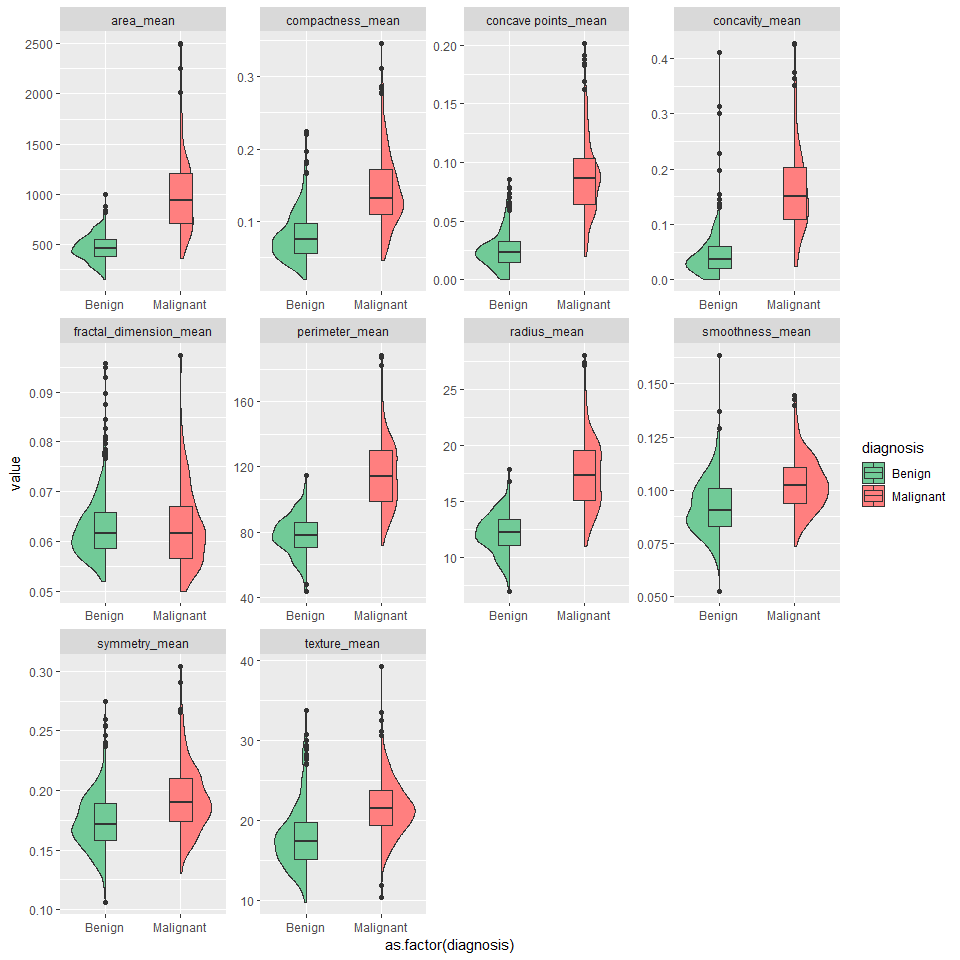
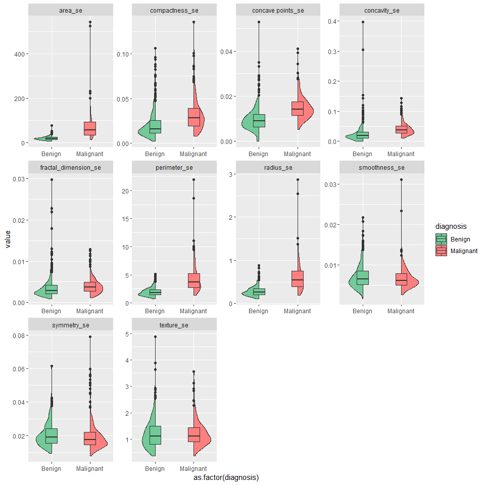
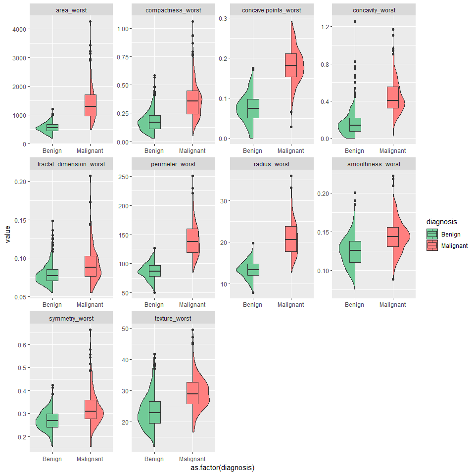
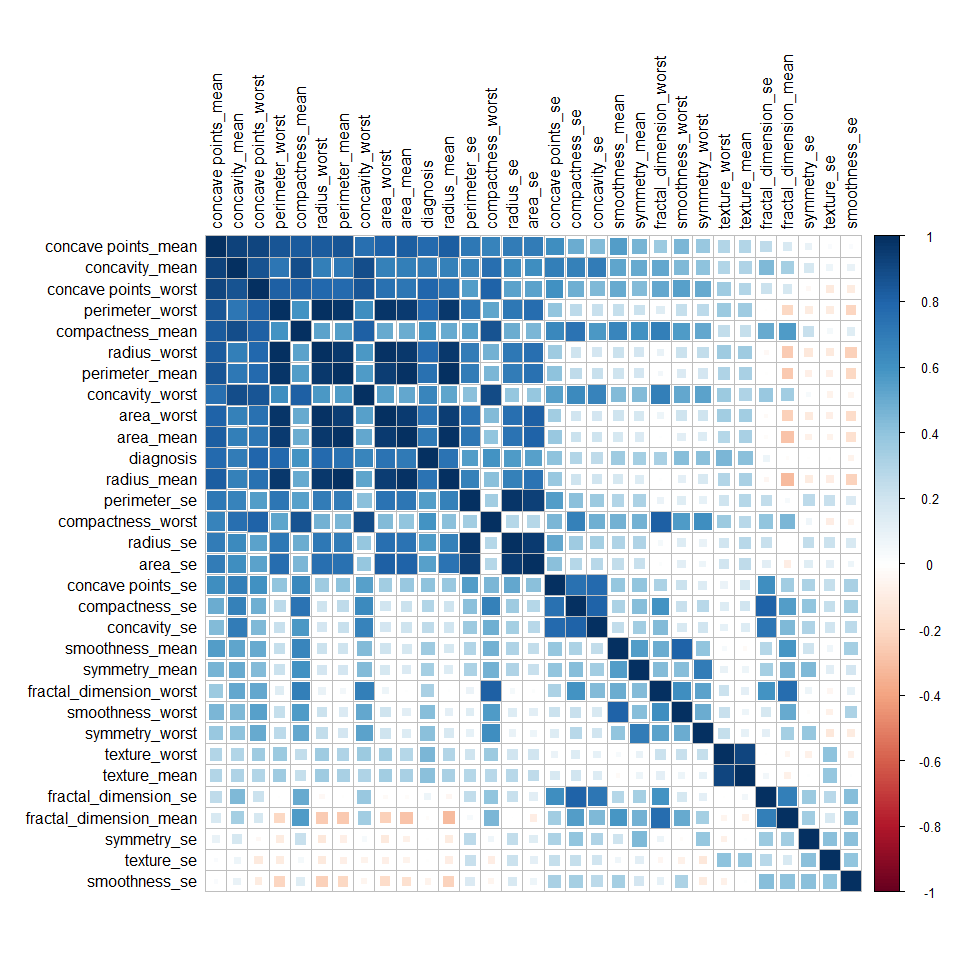
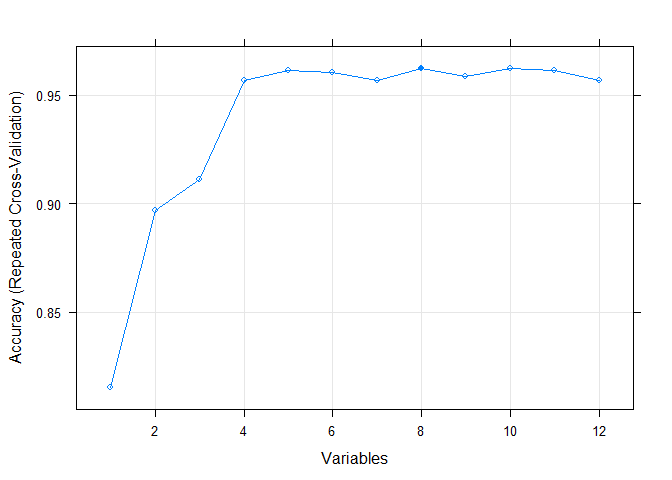
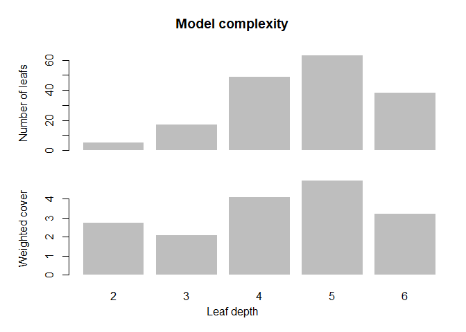
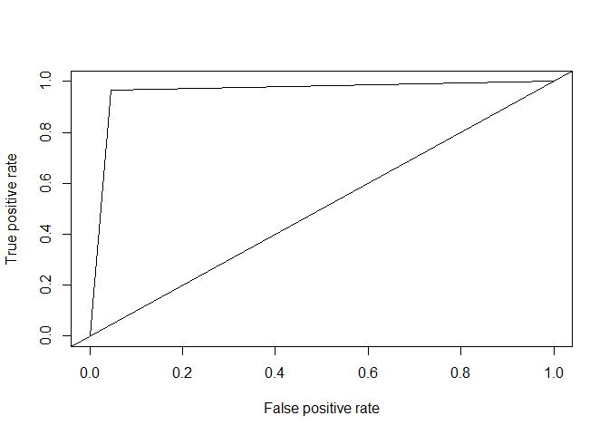

This was one of the first data sets that I had ever worked with. I thought it would be fun to revisit it as a demonstration of a few techniques and explore XGBoost. 

Please note, r-markdown {.tabset} does not render as expected on github, further complications limited graphing of XGBoost ensemble trees. See "Full HTML Report" for a complete rendering.


## Feature Plot {.tabset .tabset-fade}
Split violin / Box plot of dataset features with correspoinding Benign or Malignant diagnosis

### Mean 

<!-- -->

### SE

<!-- -->

### Worst 

<!-- -->


                                                      
                                                      
## **Correlation Plots** {.tabset .tabset-fade}
Correlation plots of features and removed highly correlated features

### Correlation 

<!-- -->


                                                      
## **Recursive Feature Selection** {.tabset .tabset-fade}

To reduce dimensionality of larger datasets and increase model performace through the reduction of noise, Recursive Feature Elimination is employed to identify the most important predictors.  

### Features of Importance

Top features as selected using Recursive Feature Elimination via Random Forest.


```
## [1] "area_mean"        "radius_se"        "texture_worst"   
## [4] "smoothness_worst" "symmetry_worst"   "concavity_se"    
## [7] "symmetry_mean"    "symmetry_se"
```

### Variable count

Plot of the number of features as a function of accuracy. 

<!-- -->

### Feature Accuracy


```
## 
## Recursive feature selection
## 
## Outer resampling method: Cross-Validated (10 fold, repeated 2 times) 
## 
## Resampling performance over subset size:
## 
##  Variables Accuracy  Kappa AccuracySD KappaSD Selected
##          1   0.8154 0.6001    0.04671 0.10120         
##          2   0.8971 0.7749    0.04152 0.09523         
##          3   0.9113 0.8076    0.03839 0.08476         
##          4   0.9569 0.9060    0.03251 0.07218         
##          5   0.9613 0.9154    0.03807 0.08564         
##          6   0.9604 0.9132    0.03509 0.07914         
##          7   0.9569 0.9058    0.03492 0.07858         
##          8   0.9622 0.9172    0.03286 0.07348        *
##          9   0.9587 0.9094    0.04081 0.09144         
##         10   0.9622 0.9170    0.03574 0.07994         
##         11   0.9613 0.9152    0.03356 0.07543         
##         12   0.9570 0.9055    0.04014 0.09005         
## 
## The top 5 variables (out of 8):
##    area_mean, radius_se, texture_worst, smoothness_worst, symmetry_worst
```


## **XGBoost Performance** {.tabset .tabset-fade}

While this data set is perhaps small for XGBoost, as a demonstration, it performs well. Data was randonly sampled into 70/30 training / testing subsets

### Tree Depth

This is a summarization of the distribution of leaves according to change in depth. To avoid over fitting reduce the tree depth as needed. 

<!-- -->


## **Confusion Matrix**

For some reason to be determined, Im seeing lower accuracy through rmd (0.9591) than when run via script (0.9766), This is (of course) also reflected below in the ROC/AUC value


```
## Confusion Matrix and Statistics
## 
##           Reference
## Prediction   0   1
##          0 106   2
##          1   5  58
##                                           
##                Accuracy : 0.9591          
##                  95% CI : (0.9175, 0.9834)
##     No Information Rate : 0.6491          
##     P-Value [Acc > NIR] : <2e-16          
##                                           
##                   Kappa : 0.9112          
##  Mcnemar's Test P-Value : 0.4497          
##                                           
##             Sensitivity : 0.9550          
##             Specificity : 0.9667          
##          Pos Pred Value : 0.9815          
##          Neg Pred Value : 0.9206          
##              Prevalence : 0.6491          
##          Detection Rate : 0.6199          
##    Detection Prevalence : 0.6316          
##       Balanced Accuracy : 0.9608          
##                                           
##        'Positive' Class : 0               
## 
```


## **ROC**

AUC value 0.089 and ROC plot 


```
## [[1]]
## [1] 0.0749476
```

<!-- -->


