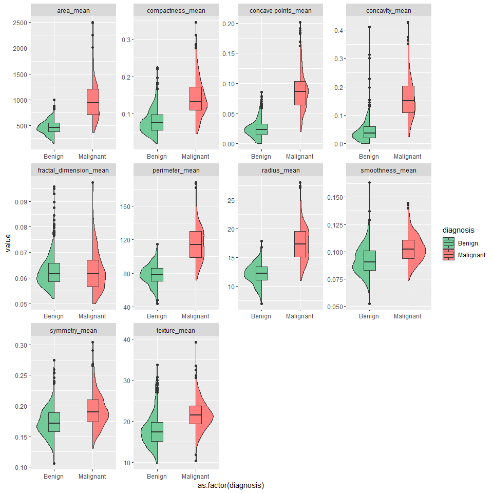
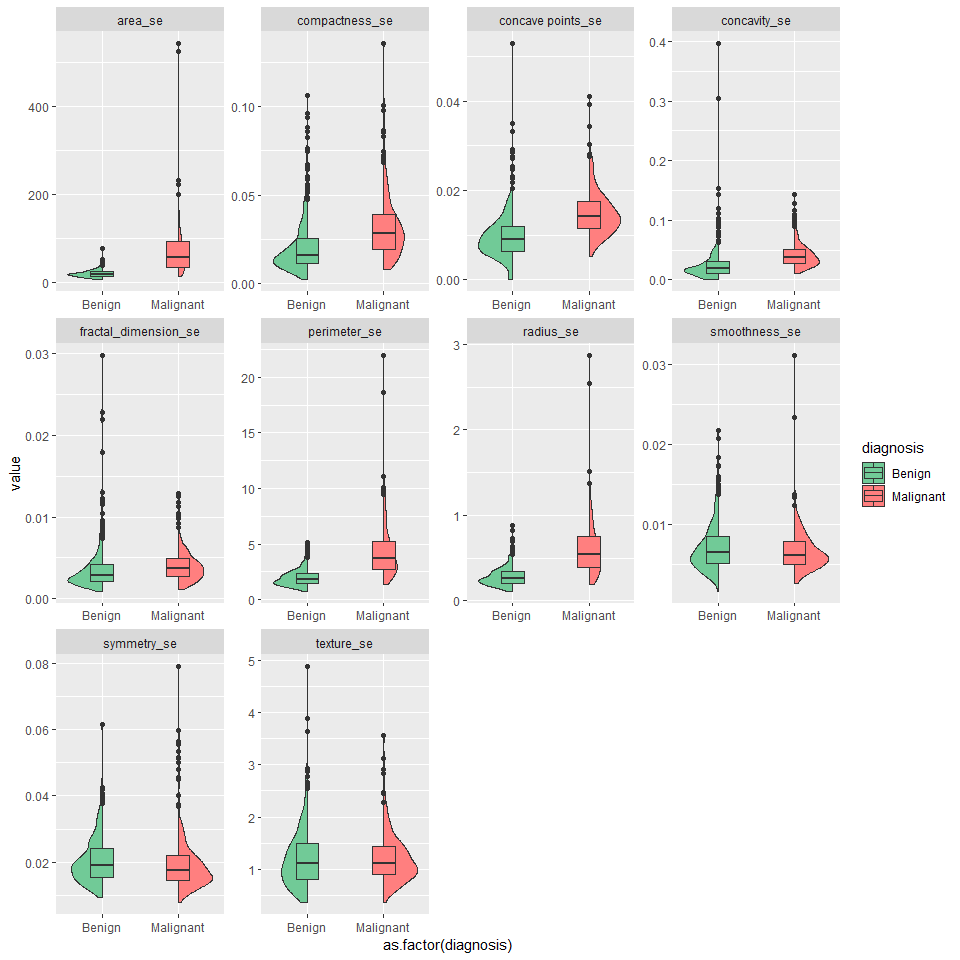

This was one of the first data sets that I had ever worked with. I thought it would be fun to revisit it as a demonstration of a few techniques and explore XGBoost. Please note, r-markdown {.tabset} does not render as expected on github, further complications limited graphing of XGBoost ensemble trees.


## Feature Plot {.tabset .tabset-fade}
Split violin / Box plot of dataset features with correspoinding Benign or Malignant diagnosis

### Mean 

<!-- -->

### SE

<!-- -->

### Worst 

<!-- -->


                                                      
                                                      
## **Correlation Plots** {.tabset .tabset-fade}
Correlation plots of features and removed highly correlated features

### Correlation 

<!-- -->


                                                      
## **Recursive Feature Selection** {.tabset .tabset-fade}

To reduce dimensionality of larger datasets and increase model performace through the reduction of noise, Recursive Feature Elimination is employed to identify the most important predictors.  

### Features of Importance

Top features as selected using Recursive Feature Elimination via Random Forest.


```
## [1] "area_mean"        "radius_se"        "texture_worst"   
## [4] "smoothness_worst" "symmetry_worst"   "concavity_se"    
## [7] "symmetry_mean"    "symmetry_se"
```

### Variable count

Plot of the number of features as a function of accuracy. 

<!-- -->

### Feature Accuracy


```
## 
## Recursive feature selection
## 
## Outer resampling method: Cross-Validated (10 fold, repeated 2 times) 
## 
## Resampling performance over subset size:
## 
##  Variables Accuracy  Kappa AccuracySD KappaSD Selected
##          1   0.8154 0.6001    0.04671 0.10120         
##          2   0.8971 0.7749    0.04152 0.09523         
##          3   0.9113 0.8076    0.03839 0.08476         
##          4   0.9569 0.9060    0.03251 0.07218         
##          5   0.9613 0.9154    0.03807 0.08564         
##          6   0.9604 0.9132    0.03509 0.07914         
##          7   0.9569 0.9058    0.03492 0.07858         
##          8   0.9622 0.9172    0.03286 0.07348        *
##          9   0.9587 0.9094    0.04081 0.09144         
##         10   0.9622 0.9170    0.03574 0.07994         
##         11   0.9613 0.9152    0.03356 0.07543         
##         12   0.9570 0.9055    0.04014 0.09005         
## 
## The top 5 variables (out of 8):
##    area_mean, radius_se, texture_worst, smoothness_worst, symmetry_worst
```


## **XGBoost Performance** {.tabset .tabset-fade}

While this data set is perhaps small for XGBoost, as a demonstration, it performs well. Data was randonly sampled into 70/30 training / testing subsets

### Ensemble trees

With most trees having the same shape, this visualizes the ensemble model. Each node reflects the features which exist in that position. 

<!--html_preserve--><div id="htmlwidget-ea77e899a1de80fb537b" style="width:960px;height:960px;" class="grViz html-widget"></div>
<script type="application/json" data-for="htmlwidget-ea77e899a1de80fb537b">{"x":{"diagram":"digraph {\n\ngraph [layout = \"dot\",\n       rankdir = \"LR\"]\n\nnode [color = \"DimGray\",\n      fillcolor = \"beige\",\n      style = \"filled\",\n      shape = \"rectangle\",\n      fontname = \"Helvetica\"]\n\nedge [color = \"DimGray\",\n     arrowsize = \"1.5\",\n     arrowhead = \"vee\",\n     fontname = \"Helvetica\"]\n\n  \"1\" [label = \"area_mean (531.2834)\nradius_se ( 16.1473)\nconcavity_se (  2.0153)\", fillcolor = \"#F5F5DC\", fontcolor = \"#000000\"] \n  \"2\" [label = \"symmetry_worst (119.15987)\nsmoothness_worst ( 24.58044)\ntexture_worst (  3.71359)\nsymmetry_se (  1.15773)\nLeaf ( -0.18069)\", fillcolor = \"#F5F5DC\", fontcolor = \"#000000\"] \n  \"3\" [label = \"radius_se (38.20979)\ntexture_worst (10.93237)\narea_mean ( 4.84068)\nLeaf ( 0.80143)\nconcavity_se ( 2.85885)\", fillcolor = \"#F5F5DC\", fontcolor = \"#000000\"] \n  \"4\" [label = \"smoothness_worst (26.9876)\ntexture_worst (13.4196)\nsymmetry_worst ( 2.7990)\nsymmetry_se ( 1.2594)\nradius_se ( 0.8298)\", fillcolor = \"#F5F5DC\", fontcolor = \"#000000\"] \n  \"5\" [label = \"radius_se ( 2.1333)\nLeaf ( 1.7347)\narea_mean (10.8371)\nsymmetry_worst ( 3.3044)\nsmoothness_worst ( 1.2893)\", fillcolor = \"#F5F5DC\", fontcolor = \"#000000\"] \n  \"6\" [label = \"Leaf (-0.86937)\nconcavity_se ( 4.26541)\nsymmetry_se ( 1.21740)\nsmoothness_worst ( 4.34243)\nsymmetry_worst ( 3.17751)\", fillcolor = \"#F5F5DC\", fontcolor = \"#000000\"] \n  \"7\" [label = \"smoothness_worst (10.68077)\nsymmetry_mean ( 2.84250)\nsymmetry_worst ( 0.33330)\nLeaf ( 0.44265)\ntexture_worst ( 2.08718)\", fillcolor = \"#F5F5DC\", fontcolor = \"#000000\"] \n  \"8\" [label = \"area_mean ( 8.60961)\nLeaf (-1.64383)\nsmoothness_worst ( 0.14261)\ntexture_worst ( 0.53697)\nsymmetry_worst ( 1.40907)\", fillcolor = \"#F5F5DC\", fontcolor = \"#000000\"] \n  \"9\" [label = \"area_mean (15.18215)\nsmoothness_worst (13.98882)\nradius_se ( 1.92856)\nLeaf (-0.24161)\nconcavity_se ( 1.15321)\", fillcolor = \"#F5F5DC\", fontcolor = \"#000000\"] \n  \"10\" [label = \"Leaf (-0.045346)\nsmoothness_worst ( 1.607937)\nsymmetry_worst ( 0.441029)\nsymmetry_mean ( 1.122918)\narea_mean ( 0.413660)\", fillcolor = \"#F5F5DC\", fontcolor = \"#000000\"] \n  \"11\" [label = \"Leaf (0.76136)\ntexture_worst (1.26307)\narea_mean (1.49608)\nconcavity_se (0.54765)\nsymmetry_worst (0.81986)\", fillcolor = \"#F5F5DC\", fontcolor = \"#000000\"] \n  \"12\" [label = \"Leaf (-0.19265)\nsymmetry_worst ( 1.16616)\", fillcolor = \"#F5F5DC\", fontcolor = \"#000000\"] \n  \"13\" [label = \"Leaf (1.32680)\nconcavity_se (0.68739)\nsmoothness_worst (0.35485)\ntexture_worst (0.90637)\narea_mean (0.37277)\", fillcolor = \"#F5F5DC\", fontcolor = \"#000000\"] \n  \"14\" [label = \"Leaf (-2.494128)\nsymmetry_se ( 0.074693)\", fillcolor = \"#F5F5DC\", fontcolor = \"#000000\"] \n  \"15\" [label = \"smoothness_worst (17.66627)\ntexture_worst ( 6.79576)\nsymmetry_worst ( 0.75312)\nLeaf (-0.35778)\", fillcolor = \"#F5F5DC\", fontcolor = \"#000000\"] \n  \"16\" [label = \"Leaf (-1.1006)\nsymmetry_se ( 1.0744)\nsymmetry_worst ( 0.4310)\", fillcolor = \"#F5F5DC\", fontcolor = \"#000000\"] \n  \"17\" [label = \"Leaf ( 0.99882)\narea_mean (12.33618)\", fillcolor = \"#F5F5DC\", fontcolor = \"#000000\"] \n  \"18\" [label = \"Leaf (-1.3813)\", fillcolor = \"#F5F5DC\", fontcolor = \"#000000\"] \n  \"19\" [label = \"Leaf (0.47188)\", fillcolor = \"#F5F5DC\", fontcolor = \"#000000\"] \n  \"20\" [label = \"Leaf (0.68360)\nconcavity_se (0.23212)\", fillcolor = \"#F5F5DC\", fontcolor = \"#000000\"] \n  \"21\" [label = \"Leaf (2.07080)\nradius_se (0.18128)\nsymmetry_se (0.66676)\", fillcolor = \"#F5F5DC\", fontcolor = \"#000000\"] \n  \"22\" [label = \"Leaf (-0.44543)\", fillcolor = \"#F5F5DC\", fontcolor = \"#000000\"] \n  \"23\" [label = \"Leaf (-0.69094)\", fillcolor = \"#F5F5DC\", fontcolor = \"#000000\"] \n  \"24\" [label = \"Leaf (-0.40016)\", fillcolor = \"#F5F5DC\", fontcolor = \"#000000\"] \n  \"25\" [label = \"Leaf (0.65905)\", fillcolor = \"#F5F5DC\", fontcolor = \"#000000\"] \n  \"26\" [label = \"Leaf (-1.7110)\nsymmetry_worst ( 1.4561)\", fillcolor = \"#F5F5DC\", fontcolor = \"#000000\"] \n  \"27\" [label = \"Leaf (0.74358)\nsymmetry_se (1.96385)\nsmoothness_worst (1.52147)\", fillcolor = \"#F5F5DC\", fontcolor = \"#000000\"] \n  \"28\" [label = \"Leaf (-0.12522)\", fillcolor = \"#F5F5DC\", fontcolor = \"#000000\"] \n  \"29\" [label = \"Leaf (-0.34153)\", fillcolor = \"#F5F5DC\", fontcolor = \"#000000\"] \n  \"30\" [label = \"Leaf (-0.5454)\", fillcolor = \"#F5F5DC\", fontcolor = \"#000000\"] \n  \"31\" [label = \"Leaf (-0.081391)\", fillcolor = \"#F5F5DC\", fontcolor = \"#000000\"] \n  \"32\" [label = \"Leaf (0.23426)\", fillcolor = \"#F5F5DC\", fontcolor = \"#000000\"] \n  \"33\" [label = \"Leaf (-0.084679)\", fillcolor = \"#F5F5DC\", fontcolor = \"#000000\"] \n  \"34\" [label = \"concavity_se (0.035615)\", fillcolor = \"#F5F5DC\", fontcolor = \"#000000\"] \n  \"35\" [label = \"Leaf (0.024777)\", fillcolor = \"#F5F5DC\", fontcolor = \"#000000\"] \n  \"36\" [label = \"Leaf (-0.30189)\", fillcolor = \"#F5F5DC\", fontcolor = \"#000000\"] \n  \"37\" [label = \"Leaf (-0.08513)\", fillcolor = \"#F5F5DC\", fontcolor = \"#000000\"] \n  \"38\" [label = \"Leaf (-0.17378)\nconcavity_se ( 0.81700)\", fillcolor = \"#F5F5DC\", fontcolor = \"#000000\"] \n  \"39\" [label = \"Leaf (0.76964)\nsymmetry_se (0.24788)\", fillcolor = \"#F5F5DC\", fontcolor = \"#000000\"] \n  \"40\" [label = \"Leaf (0.24341)\", fillcolor = \"#F5F5DC\", fontcolor = \"#000000\"] \n  \"41\" [label = \"smoothness_worst (0.63227)\nsymmetry_se (1.08732)\nradius_se (0.18431)\", fillcolor = \"#F5F5DC\", fontcolor = \"#000000\"] \n  \"42\" [label = \"Leaf (0.034296)\", fillcolor = \"#F5F5DC\", fontcolor = \"#000000\"] \n  \"43\" [label = \"Leaf (0.13214)\", fillcolor = \"#F5F5DC\", fontcolor = \"#000000\"] \n  \"44\" [label = \"Leaf (-0.16585)\", fillcolor = \"#F5F5DC\", fontcolor = \"#000000\"] \n  \"45\" [label = \"Leaf (0.10353)\", fillcolor = \"#F5F5DC\", fontcolor = \"#000000\"] \n  \"46\" [label = \"Leaf (0.28937)\", fillcolor = \"#F5F5DC\", fontcolor = \"#000000\"] \n  \"47\" [label = \"Leaf (0.07676)\", fillcolor = \"#F5F5DC\", fontcolor = \"#000000\"] \n  \"48\" [label = \"Leaf (-0.053221)\", fillcolor = \"#F5F5DC\", fontcolor = \"#000000\"] \n  \"49\" [label = \"Leaf (0.37632)\", fillcolor = \"#F5F5DC\", fontcolor = \"#000000\"] \n  \"50\" [label = \"Leaf (0.041453)\", fillcolor = \"#F5F5DC\", fontcolor = \"#000000\"] \n  \"51\" [label = \"Leaf (0.22678)\", fillcolor = \"#F5F5DC\", fontcolor = \"#000000\"] \n  \"1\"->\"2\" \n  \"2\"->\"4\" \n  \"3\"->\"6\" \n  \"4\"->\"8\" \n  \"5\"->\"10\" \n  \"7\"->\"12\" \n  \"8\"->\"14\" \n  \"9\"->\"16\" \n  \"15\"->\"18\" \n  \"13\"->\"20\" \n  \"16\"->\"22\" \n  \"17\"->\"24\" \n  \"6\"->\"26\" \n  \"14\"->\"28\" \n  \"10\"->\"30\" \n  \"12\"->\"32\" \n  \"26\"->\"34\" \n  \"34\"->\"36\" \n  \"11\"->\"38\" \n  \"27\"->\"40\" \n  \"41\"->\"42\" \n  \"38\"->\"44\" \n  \"39\"->\"46\" \n  \"21\"->\"48\" \n  \"20\"->\"50\" \n  \"1\"->\"3\" \n  \"2\"->\"5\" \n  \"3\"->\"7\" \n  \"4\"->\"9\" \n  \"5\"->\"11\" \n  \"7\"->\"13\" \n  \"8\"->\"15\" \n  \"9\"->\"17\" \n  \"15\"->\"19\" \n  \"13\"->\"21\" \n  \"16\"->\"23\" \n  \"17\"->\"25\" \n  \"6\"->\"27\" \n  \"14\"->\"29\" \n  \"10\"->\"31\" \n  \"12\"->\"33\" \n  \"26\"->\"35\" \n  \"34\"->\"37\" \n  \"11\"->\"39\" \n  \"27\"->\"41\" \n  \"41\"->\"43\" \n  \"38\"->\"45\" \n  \"39\"->\"47\" \n  \"21\"->\"49\" \n  \"20\"->\"51\" \n}","config":{"engine":"dot","options":null}},"evals":[],"jsHooks":[]}</script><!--/html_preserve-->

### Tree Depth

This is a summarization of the distribution of leaves according to change in depth. To avoid over fitting reduce the tree depth as needed. 

<!-- -->


## **Confusion Matrix**

For some reason to be determined, Im seeing lower accuracy through rmd (0.9591) than when run via script (0.9766), This is (of course) also reflected below in the ROC/AUC value


```
## Confusion Matrix and Statistics
## 
##           Reference
## Prediction   0   1
##          0 106   2
##          1   5  58
##                                           
##                Accuracy : 0.9591          
##                  95% CI : (0.9175, 0.9834)
##     No Information Rate : 0.6491          
##     P-Value [Acc > NIR] : <2e-16          
##                                           
##                   Kappa : 0.9112          
##  Mcnemar's Test P-Value : 0.4497          
##                                           
##             Sensitivity : 0.9550          
##             Specificity : 0.9667          
##          Pos Pred Value : 0.9815          
##          Neg Pred Value : 0.9206          
##              Prevalence : 0.6491          
##          Detection Rate : 0.6199          
##    Detection Prevalence : 0.6316          
##       Balanced Accuracy : 0.9608          
##                                           
##        'Positive' Class : 0               
## 
```


## **ROC**

AUC value 0.089 and ROC plot 


```
## [[1]]
## [1] 0.0749476
```

<!-- -->


